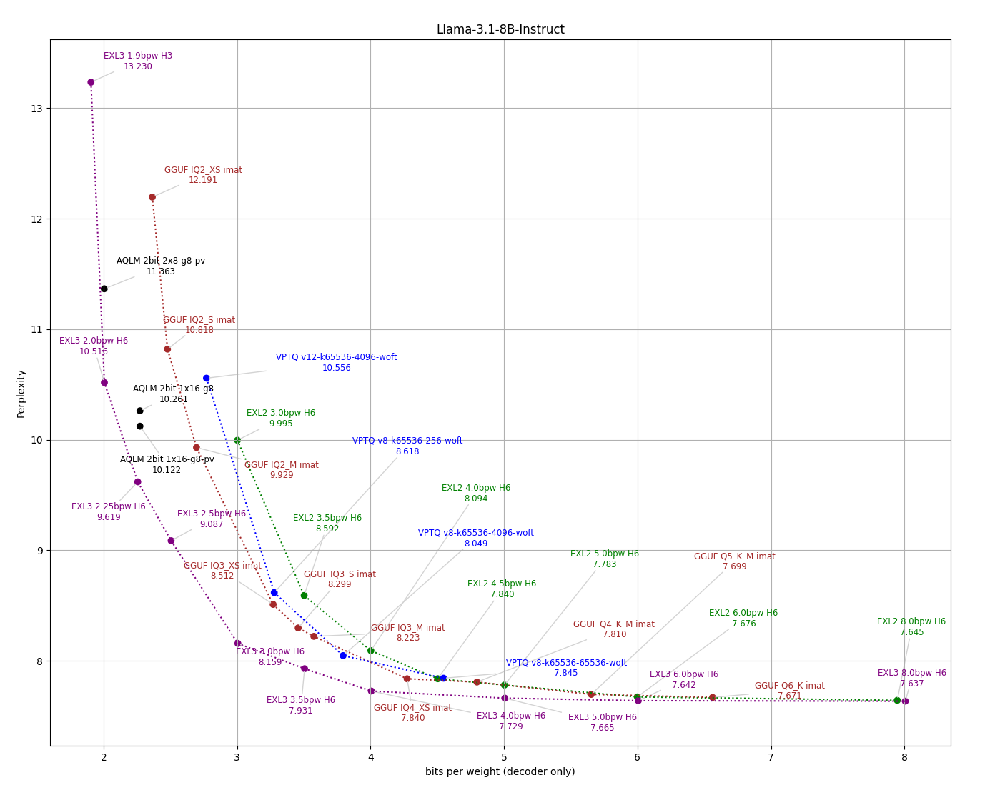
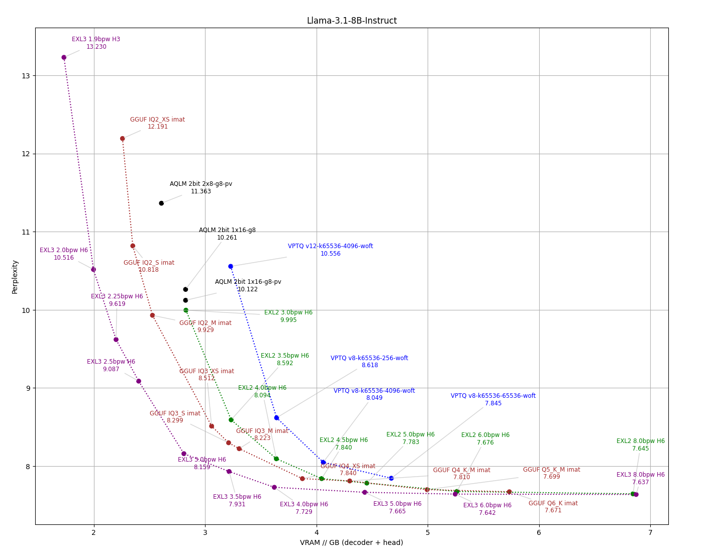
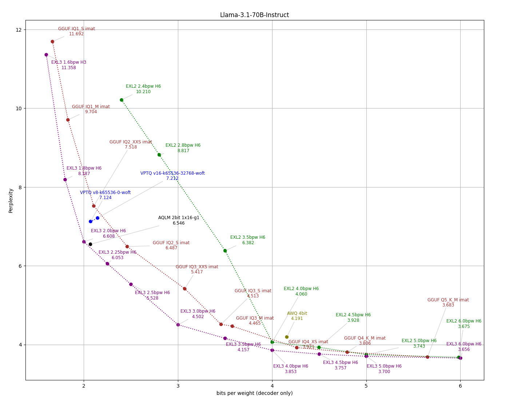
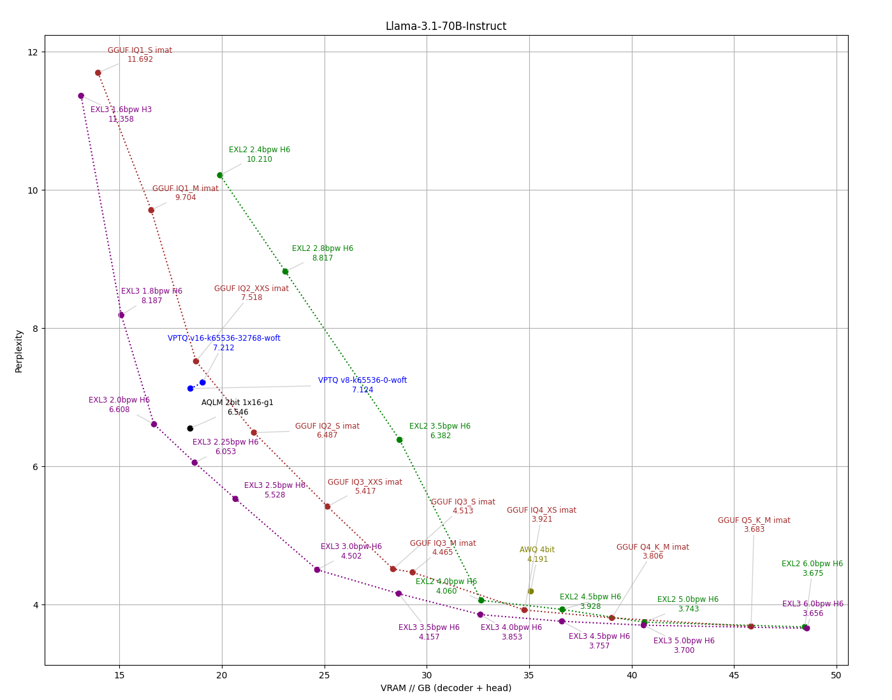
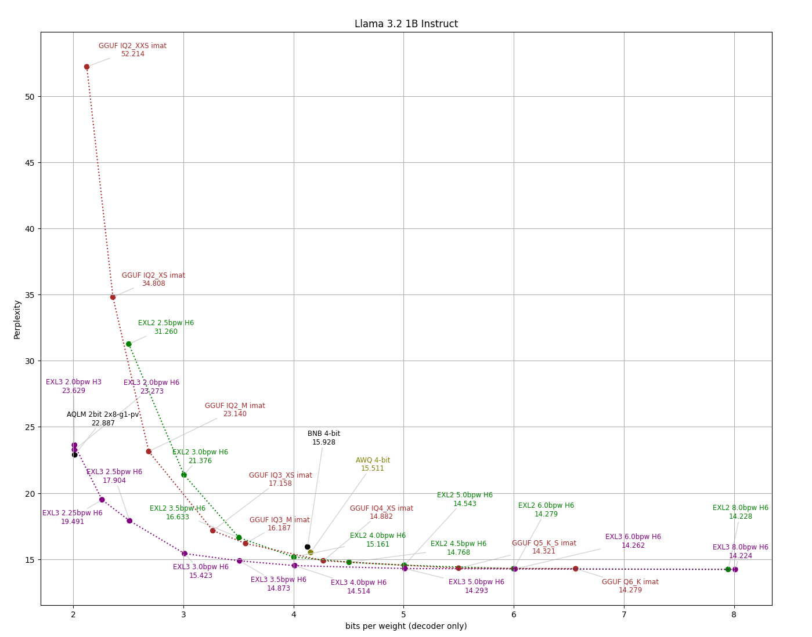
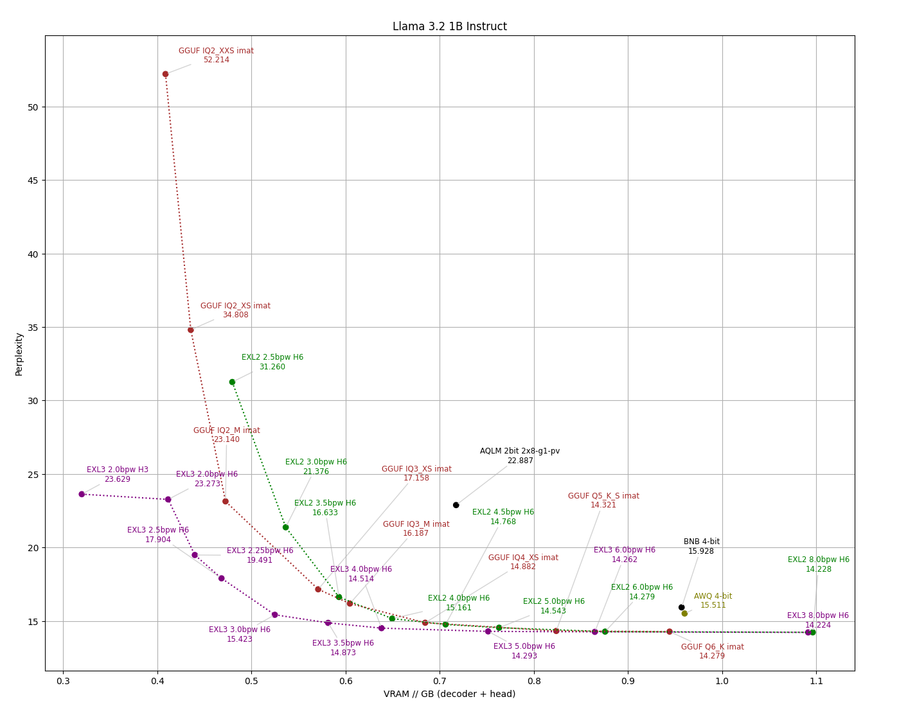
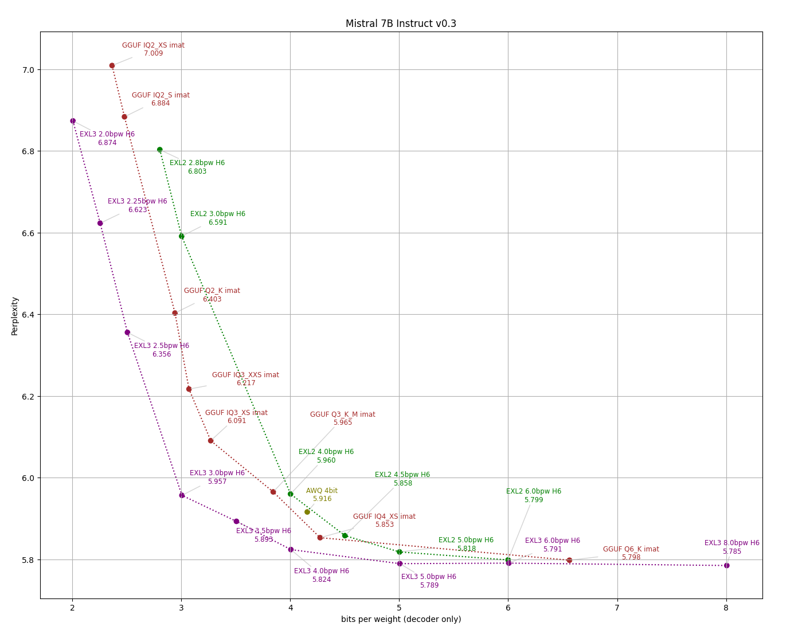
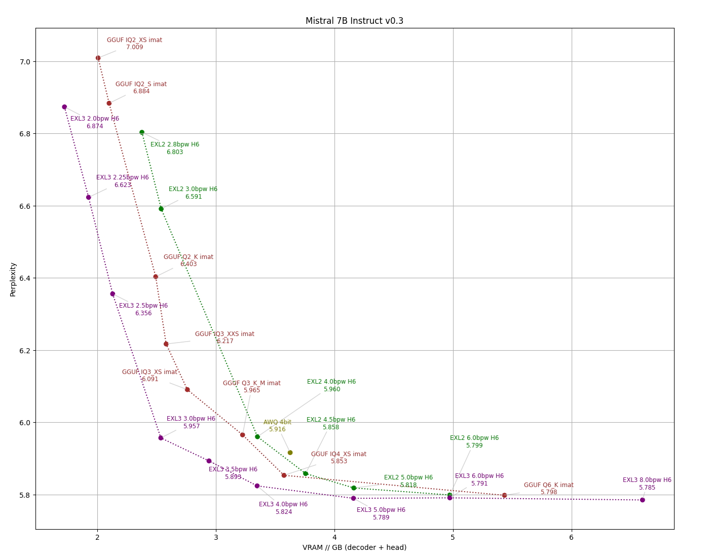
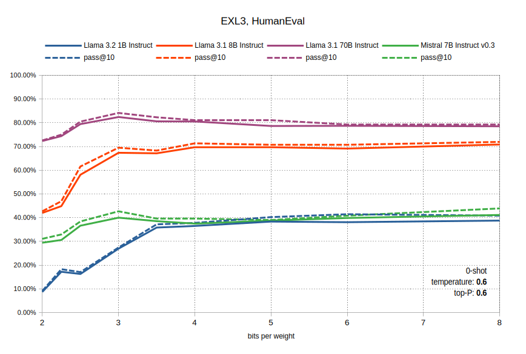

# EXL3 quantization

The new **EXL3** format is a variant of [**QTIP**](https://github.com/Cornell-RelaxML/qtip). Like **QTIP** it uses a procedural codebook and encodes high-dimensional vectors into optimal tail-biting trellis structures, but it deviates from **QTIP** in how tensors are regularized and packed. A full description of the format is coming, but until then I refer to the code for the [quantizer](../exllamav3/modules/quant/exl3_lib/quantize.py) and associated [kernels](../exllamav3/exllamav3_ext/quant), the [**QTIP**](https://arxiv.org/abs/2406.11235) and [**QuIP#**](https://arxiv.org/abs/2402.04396) papers, as well as this [excellent writeup](https://www.together.ai/blog/even-better-even-faster-quantized-llms-with-qtip) on **QTIP** from together.ai.

It turns out to be difficult to collect enough examples of models converted with the various SOTA (or SOTA-adjacent) methods. I attribute the lack of options largely to how difficult it is to work with these formats in the first place, hence this project. Following are some benchmarks and comparisons to other formats I was able to find samples of. A couple of notes:

- I have not yet been able to make regular **QTIP** inference work (go figure) but it's probably safe to assume it would match or outperform **EXL3** in accuracy, being largely the same method except with more options.
- Accounting for quantization of the output layer can make a huge difference in practice, especially for smaller models. So I am including two versions of each perplexity graph, one with bitrate on the horizontal axis, and one that measures the entire VRAM footprint of the weights (not counting the embedding layer which for most inference tasks can be relegated to system RAM.)
- **GGUF** i-quants are abundant, and it's worth noting that they hold up well in comparison to SOTA formats.

### Perplexity tests

The [eval/compare_q.py](../eval/compare_q.py) script makes an apples-to-apples comparison between formats, measuring perplexity on the wiki2 test set across available bitrates while ensuring that tokenization and scoring remains consistent throughout.

<b>Llama 3.1 8B Instruct</b>

  
  

<b>Llama 3.1 70B Instruct</b>

  
  

<b>Llama 3.2 1B Instruct</b>

  
  

<b>Mistral 7B Instruct v0.3</b>

  
  

### HumanEval

For the models tested here, HumanEval scores align closely with results advertised by the publishers or collected from other sources. Some deviation is to be expected due to differences in prompting and sampling, as well as random variation. See the [eval/humaneval.py](../eval/humaneval.py) script for specifics. The occasional bump around 3 bpw is repeatable and statistically significant, likely worth investigating. 

  

### Further work

More evaluations are underway (MMLU, MMLU-Pro, etc.), and more models will be tested as architectures are added.
